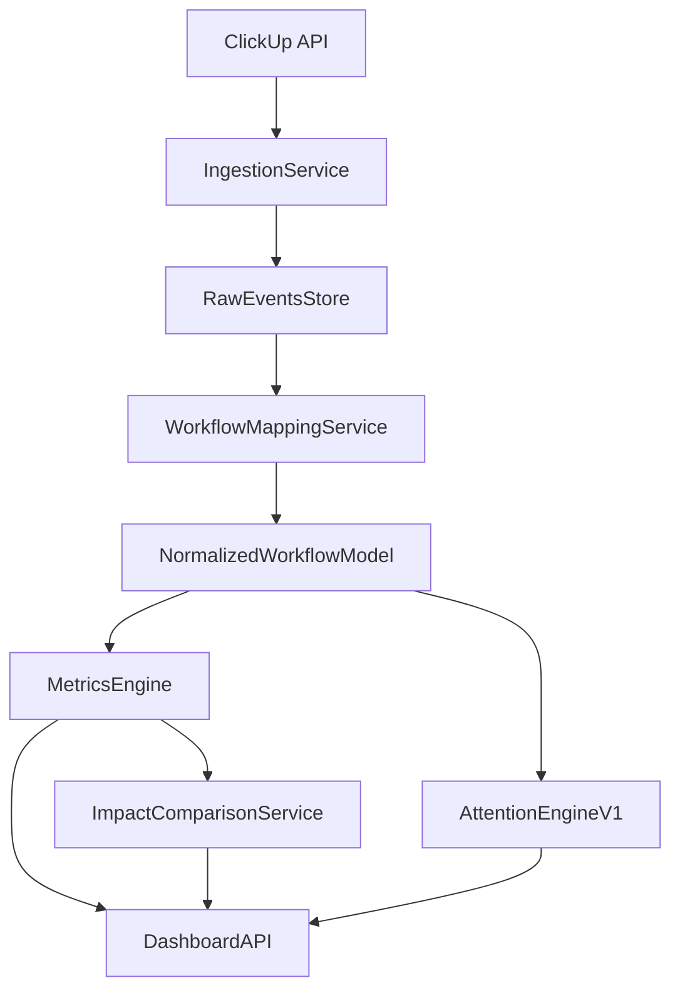

# MVP Implementation Plan

## 1) Objective

Build a standalone web product (MVP) that:

- connects to ClickUp;
- imports historical and ongoing task workflow data;
- calculates lifecycle metrics;
- highlights tasks requiring manager attention;
- shows before/after impact to prove product value.

This plan is execution-focused and follows the approved product scope.

## 2) MVP Functional Scope

Must-have capabilities:

1. Account and workspace setup.
2. Email verification for newly registered users.
3. Workspace member invitations and role-based membership.
4. ClickUp connection.
5. Historical data import (2-3 months).
6. Incremental sync job.
7. Workflow mapping setup.
8. Lifecycle metrics engine.
9. Attention Engine v1.
10. Dashboard UI.
11. Value/Impact (before vs after) dashboard.
12. Russian-first user interface across all MVP screens.

Out of scope:

- advanced ML predictions;
- multi-integrations in same release;
- enterprise white-label and on-prem packaging.

MVP+ scope (immediately after core MVP):

- AI Task Description Quality scoring.
- AI narrative summaries for flagged tasks and weekly bottlenecks.
- AI suggested manager actions (guardrailed templates).

## 3) Recommended Delivery Architecture (MVP)

Suggested stack (Python-first):

- Backend API: FastAPI
- Background jobs (**post-MVP / at scale:** Celery or equivalent worker queue; **MVP relies on on-demand imports + lightweight in-process schedulers where enabled**)
- Relational store: PostgreSQL
- Optional analytics acceleration: ClickHouse later if needed
- Frontend: React (or Next.js)

UX/application structure should mirror the proven Research Flow shell pattern:

- public/auth pages without sidebar;
- authenticated app pages with sidebar + top bar shell;
- workspace-centric navigation and settings area;
- separate admin/settings routes in the same app.

Localization requirement:

- All user-facing MVP screens and system messages must be in Russian.
- Build with i18n-ready structure so English can be added later with minimal refactor.

### 3.1 i18n Implementation Approach (MVP)

Use a key-based localization model from day one.

Defaults:

- Default locale: `ru`
- Fallback locale: `en`

Rules:

1. No hardcoded UI strings in components.
2. All user-facing text must be resolved through translation keys.
3. Error messages from backend should support localization keys or mapped translation codes.
4. Date/time/number formatting should use locale-aware formatters.

Suggested translation domains:

- `common.*` (buttons, labels, generic actions)
- `auth.*` (registration, login, email verification)
- `workspace.*` (members, invites, roles, settings)
- `integration.clickup.*` (connection, scope selection, sync states)
- `workflowMapping.*` (status mapping and validation messages)
- `dashboard.*` (metrics, charts, filters)
- `attention.*` (signals, severity labels, action prompts)
- `impact.*` (before/after value view and commentary)
- `aiInsights.*` (MVP+ narrative summaries and recommendations)

Quality gates:

- Block release if untranslated keys remain in `ru`.
- Add a test/check that reports missing keys for `ru` and `en`.
- Keep copy glossary for consistent terminology across metrics and statuses.

MVP data flow:

### 3.2 Current implementation status (living)

Monorepo: `backend/` (FastAPI), `frontend/` (Next.js 14 App Router), `infra/`, `docs/`. Repository: [`colaisr/teamup`](https://github.com/colaisr/teamup). `.env`/secrets excluded from Git; `.env.example` at repo root; local DB often SQLite (`*.db` gitignored).

| Phase | Status | Notes |
|-------|--------|--------|
| **0 — Product foundations** | **Done** (docs) | Foundations, glossaries, pilot scope, permissions etc. under `docs/`. |
| **1 — Bootstrap** | **Done** | Auth (JWT `Bearer`, `/api/auth/*`), registration + email verification, login; **`last_active_workspace_id`** persisted (`users`), **`GET /api/workspaces`** returns **`is_current`**, **`POST …/switch`** aligns server + frontend cache; **`PUT`** rename + member role updates (**owner**); **no workspace `DELETE`** from API (InfraZen-style); **invites** owner-only (**`GET`** full history vs pending via **`pending_only`**, **immediate membership** when invitee already registered); sidebar: **dashboard / attention / impact / integrations** + footer workspace switcher; workspaces **management** at **`/settings/user?tab=workspaces`** (**`/settings/workspace`** & **`/settings/members`** redirect); shield → **`/settings/system`** for **`is_system_admin`**. CI: `pytest`, `compileall`, ESLint, `next build`; auth pages `<Suspense>` for `useSearchParams`. Celery not in Phase 1. |
| **2 — ClickUp** | **Partial** | **Personal API token** path only (**OAuth deferred** — `docs/CLICKUP_OAUTH_PHASE2.md`). **Multiple ClickUp connections** per TeamUp workspace; connection-scoped APIs: list/create by `workspace_id`, **`GET`/`PUT` credentials** (admin; **GET** returns decrypted token for edit-prefill), verify-token, scopes (teams/spaces/lists), scope save, statuses, mapping CRUD, **POST import** per `connection_id`. Legacy “latest connection” workspace routes are still documented in code. |
| **3 — Ingestion** | **Partial (MVP-adequate)** | **On-demand import** supports **`auto`** (incremental after `last_synced_at` with overlap), **`incremental`**, **`full`** (~90 days by `date_created_gt`). Import writes `Task`, `TaskTransition`, `ClickUpRawEvent`; status parsing hardened; **`tasks.task_type`** as **TEXT** on PostgreSQL. **Time in Status** wired when ClickUp exposes it; otherwise sync succeeds with an explicit warning. **Sync observability** on connections and integrations UI (**incremental / full**). **In-process scheduler pilot** (`CLICKUP_SYNC_SCHEDULER_*`). **Not required for MVP closure:** migrating this to Celery/a worker queue or building a deeper automated retry playbook—those are **post-MVP / production-scale** improvements if traffic demands them. |
| **4 — Mapping** | **Partial (UX strengthened)** | Mapping persisted per **connection + scope** with **versioning** on save. **Wizard** on **`/settings/integrations`** includes mandatory **status mapping** before **`ready`**; client **auto-suggest**. **Analytics gating** (`metrics`, `attention`, `impact`, AI explain) returns **HTTP 403** with structured `detail: { code: analytics_mappings_incomplete, message }` (not RU-text-only heuristics). **Product UI:** shared **`AnalyticsMappingBlockedCallout`** on **`/dashboard`**, **`/attention`**, **`/impact`**, and the **AI assistant** panel; **`/onboarding/mapping`** uses i18n-only copy. **Still polishable:** edge-case hints per connection state (draft vs missing mapping). |
| **5 — Normalized storage** | **Partial** | SQLAlchemy models + **`connection_id`** on tasks, transitions, raw events, workflow mappings; multi-connection migration/backfill; Postgres prod; SQLite dev. **`tasks.task_type`** widened to **TEXT** on PostgreSQL via startup migration. |
| **6 — Metrics engine** | **Done (API/core)** | `GET /api/analytics/metrics/{workspace_id}` now returns lifecycle breadth aligned with Phase 6 core deliverables: lead/cycle medians, time-in-status, **idle time**, **flow efficiency**, rework/reopen, loop totals, plus **aggregations by task type** and **weekly period buckets**. Mapping remains connection-aware with legacy fallback for missing `connection_id`. UI storytelling depth on top of this dataset is still a Phase 8 refinement item. |
| **7 — Attention v1** | **Done (rule engine v1)** | `GET /api/analytics/attention/{workspace_id}` now applies Phase 7 signal set with rule-based explanations and severity: **stuck in status vs P90 baseline**, **high loop count**, **inactivity breach**, **overdue/open too long**, with per-signal payload (`code`, `severity`, threshold/observed context), score, and suggested action. |
| **8 — Dashboard UI** | **Done (MVP scope)** | Manager-grade UI pass is now applied across **`/tasks`**, **`/settings/integrations`**, **`/attention`**, **`/impact`**, and **`/dashboard`**: auto-load from active workspace, summary KPI strips, responsive non-overflow card/list layouts, semantic risk/status chips, and progressive disclosure (filters/details/history). `/dashboard` now consumes expanded Phase 6/7 payloads with bottleneck/time-in-status drilldowns, task-type breakdown, and weekly trend strip; `/attention` renders severity + structured signal details; `/integrations` and `/tasks` include clearer action hierarchy and drilldown ergonomics. Additional hardening: task-type data normalization prevents raw custom-field JSON from leaking into dashboard grouping and shows no-data states when cycle/flow samples are absent. Shell/sidebar remains viewport-safe with collapse/expand rail mode; global dark/light theme toggle is available in user settings and applied app-wide. |
| **9 — Value / Impact** | **Partial** | Live vs latest **baseline**; first baseline after import when mappings exist; manual baseline/current; **history API** + raw table; **SVG trends**; optional **`weekly`** snapshots (`IMPACT_WEEKLY_SNAPSHOT_*`). **UI:** pilot-oriented block (**`impact.pilot*`** / **`impact.narrative*`** copy), improved/worsened strips, summary KPI cards, responsive per-metric comparison cards (baseline/current/Δ/Δ%), and collapsible trends/history drilldown for cleaner first paint. **Still polishable:** export/share, denser executive summary card, AI-assisted impact narrative (MVP+). |
| **10 — Pilot ops** | **Not started** | Process — see `docs/PILOT_RUNBOOK.md`. |
| **8.5 / MVP+ AI** | **Partial** | **Foundation shipped:** system-admin AI settings in **`/settings/system`** (OpenRouter key/model + refresh models + test connection), provider abstraction in **`openrouter_client.py`** (`chat_complete`, model resolution, shared errors), central platform config in **`ai_platform.py`**, audit tables **`ai_runs`** + **`ai_outputs`**, and first product endpoint **`POST /api/ai/attention/{workspace_id}/explain-task`**. Explain context now supports **`include_subtasks`** to analyze task trees (task + descendants, merged reasons/transitions/evidence). Frontend scaffolding: global assistant panel + per-task explain actions on `/attention` and `/tasks`. **Still open:** task-quality scoring, workspace/impact narratives, full chat sessions/messages persistence, optional streaming UX. |

Cross-cutting gaps vs DoD MVP: §3.1 i18n quality gate is now wired in CI (dictionary parity drift check), but existing baseline debt still needs burn-down (missing `ru`/`en` pairs + remaining non-core literal cleanup); extra **Impact** presentation (export, MVP+ AI narrative); Postgres-backed parity tests where needed; and continued data hygiene for imported taxonomy fields if new ClickUp field shapes appear. **UI consistency standard (Product -> UX -> UI)** is now applied across core manager surfaces (`/tasks`, `/integrations`, `/attention`, `/impact`, `/dashboard`) with active-workspace auto-load and responsive content-first layouts. **Post-MVP (when scaling traffic):** replace in-process scheduler threads with queue/worker deployments and deepen retry/backoff—not listed as MVP exit blockers here. For **MVP+ AI**: task-quality scoring, workspace/impact narratives, full chat session lifecycle.

See also **`PROJECT_OVERVIEW.md` § Implementation wiki.**

### 3.3 Recommended next engineering steps

These steps close the strongest gaps versus §2 and §10 (Definition of Done), in pragmatic order:

1. **Workflow mapping enforcement UX (Phase 4)** — **Primary gap closed:** stable **`analytics_mappings_incomplete`** code on 403, shared **mapping-blocked callout**, **`api()`** `apiErrorCode`, localized onboarding + dashboard metric labels. Optional follow-ups: per-connection wizard hints when `setup_status !== ready` without noisy banners everywhere.
2. **Impact parity (§6 notes + Phase 9)** — Baseline, comparison API, history, trends, commentary, weekly pilot, and **in-product pilot narrative + comparison table** on **`/impact`** are shipped. **Next:** optional export, or MVP+ **AI impact narrative**; otherwise shift focus to **dashboard (4)** / **metrics & attention (3)** for pilot storytelling.
3. **§3.1 i18n debt burn-down** — CI parity gate is active; now reduce baseline key gaps and remove remaining stray literals outside localized surfaces.
4. **Pilot readiness (Phase 10)** — With core pages reworked and Phase 6/7 + Phase 8 engines in place, execute `docs/PILOT_RUNBOOK.md` against real interventions, validate KPI movement cadence, and tune thresholds/copy from pilot feedback.
5. **AI capability rollout on new foundation (Phase 8.5)** — Keep deterministic context + evidence refs mandatory; add **workspace takeaways**, **impact narrative**, **task description quality** atop `ai_runs`/`ai_outputs` + `/api/ai`.

*(**Post-MVP / scale:** Celery-or-equivalent workers, automated retry tiers, fully durable job queues—explicitly **out of MVP critical path** unless your deployment already demands them.)*

If you must pick **one** next milestone: **§3.1 i18n debt burn-down (3)** for release hygiene, or **Pilot readiness (4)** if you are moving straight into controlled internal rollout.

## 4) Execution Phases

### Phase 0 - Product and Metric Decisions

Deliverables:

- Freeze metric definitions for MVP.
- Freeze baseline/adoption measurement windows.
- Define status categories and mapping UX requirements.

Exit criteria:

- Signed-off metric glossary and workflow mapping rules.

### Phase 1 - Project Bootstrap

Deliverables:

- Backend and frontend repositories initialized.
- Environment and config strategy.
- Auth and basic workspace model (owner/admin/member roles).
- Registration email verification flow.
- Workspace invitation flow (invite, accept, revoke).
- Russian-first localization baseline (routing/text strategy and translation dictionary scaffolding).
- Initial CI checks (lint/test skeleton).

Exit criteria:

- User can register, verify email, sign in, create workspace shell, and invite teammate.

**Status:** Satisfied for this codebase; details are in §3.2 *Current implementation status*.

### Phase 2 - ClickUp Integration

Deliverables:

- OAuth/API token connection flow.
- "Select scope" UI (workspace/list/project).
- Connection validation endpoint.

Exit criteria:

- Connected workspace can fetch project/list metadata and statuses.

### Phase 3 - Data Ingestion Pipeline

Deliverables:

- Historical import job (2-3 months).
- Incremental sync job (scheduled **for MVP**: manual triggers + optional in-process scheduler; **queue/worker offload is post-MVP** unless you explicitly scope it earlier).
- Ingest task core fields, status changes, assignees, timestamps, available time data.
- Lightweight data quality posture: observable sync outcomes and surfaced errors (**deep automated retry / Celery backlog: explicitly not MVP-critical—see §3.2 Phase 3**).

Exit criteria:

- Stable ingestion with observable logs **for the MVP pilot footprint** (on-demand import + pilot scheduler acceptable). Dedicated worker fleets and exhaustive retry tiers are optional hardening afterward.

### Phase 4 - Workflow Mapping Setup (Critical)

Deliverables:

- Fetch all source statuses from selected ClickUp scope.
- Auto-suggest mapping to normalized categories.
- Mapping confirmation/edit UI.
- Save mapping version per connected scope.

Normalized categories (MVP):

- Not Started
- Ready
- In Progress
- Review
- QA
- Blocked
- Done
- Cancelled

Behavior rules:

- No analytics until mapping is confirmed.
- When analytics are blocked, APIs return **403** with `detail` shaped as **`{ "code": "analytics_mappings_incomplete", "message": "…" }`** so clients do not rely on parsing localized prose alone (`workspace_mapping_gate`).
- Mapping changes create a new mapping version.
- Impact comparisons can be segmented by mapping version.

Exit criteria:

- Source statuses are fully mapped and persisted.

### Phase 5 - Normalized Data Model and Storage

Deliverables:

- Persistent model for tasks, transitions, mapping, and computed snapshots.
- Derived lifecycle events for metrics engine.
- Data retention strategy for pilot scale.

Exit criteria:

- Metrics engine can query normalized lifecycle records reliably.

### Phase 6 - Lifecycle Metrics Engine

Deliverables:

- Compute Lead Time, Cycle Time, Time in Status, Idle Time, Flow Efficiency.
- Compute Rework Rate, Loop Count, Reopen Rate.
- Aggregations by period and task type.

Exit criteria:

- Metrics are available via API and match validation samples.

### Phase 7 - Attention Engine v1

Deliverables:

- Rule-based scoring for task attention priority.
- Initial signals:
  - stuck in status (vs baseline quantiles),
  - high loop count,
  - inactivity threshold breach,
  - overdue/open too long.
- Task-level explanation payload for each flag.

Exit criteria:

- "Top tasks requiring attention" list available with reasons and severity.

### Phase 8 - Dashboard UI

Deliverables:

- Overview metrics cards.
- Bottleneck/time-in-status views.
- Attention list with filters and drilldown.
- Trend charts (weekly).
- App shell parity pattern:
  - auth/public routes without shell;
  - app routes with sidebar + top bar;
  - workspace settings/members/invites screens.

Exit criteria:

- Managers can identify priorities without raw report export.

### Phase 8.5 - AI Assist Layer (MVP+)

Deliverables:

- Task Description Quality analysis endpoint and UI badge.
- AI narrative summary for weekly bottlenecks and impact changes.
- AI next-step suggestions with evidence references from deterministic metrics.
- AI usage logging (viewed, accepted, ignored actions).

Constraints:

- Deterministic metrics remain source of truth.
- AI output must be grounded in observed task facts and metric deltas.
- Recommendation text must come from controlled templates.

Exit criteria:

- Managers receive useful AI summaries without reducing trust in core analytics.

### Phase 9 - Value / Impact Dashboard

Deliverables:

- Baseline snapshot at pilot start.
- Current period snapshot.
- Before/after comparison cards and charts (including **snapshot-history trend charts** on `/impact`).
- Change commentary block ("what improved / worsened").

Exit criteria:

- Product can generate a clear internal value report from real usage.

### Phase 10 - Internal Pilot and Iteration

Deliverables:

- 2-4 week active use by your team managers.
- Intervention log (actions taken based on product signals).
- Post-pilot review and prioritized backlog for next release.

Exit criteria:

- Decision: proceed to external pilot (Yandex Tracker or Jira partner).

## 5) Attention Engine v1 Rules (Initial Spec)

Use transparent, explainable rules in MVP.

Suggested score components:

- StatusDelayScore
- LoopScore
- InactivityScore
- OverdueScore

Example final score:

`AttentionScore = 0.4 * StatusDelay + 0.25 * Loop + 0.2 * Inactivity + 0.15 * Overdue`

Each flagged task must include:

- triggered rules;
- baseline comparison (for example "3.1x above median QA time");
- suggested manager next step.

## 6) Baseline vs After-Use Implementation Notes

To emphasize value, build this into MVP from day one:

1. On first successful historical import, persist baseline snapshot.
2. Recompute periodic snapshots weekly.
3. Compare baseline to current/adoption windows.
4. Keep definitions stable; if mapping changes, segment results by mapping version.

## 7) Delivery Timeline (Practical)

Suggested schedule (can be adjusted):

- Weeks 1-2: Phases 0-2
- Weeks 3-4: Phases 3-5
- Weeks 5-6: Phases 6-8
- Week 7: Phase 8.5 + Phase 9
- Weeks 8-10: Phase 10 (pilot and iteration)

## 8) Risks and Mitigation

Risk: inconsistent source workflows.

- Mitigation: mandatory mapping step + mapping versioning.

Risk: weak value evidence.

- Mitigation: baseline snapshot + impact dashboard in MVP.

Risk: noisy outliers skew metrics.

- Mitigation: medians/quantiles and task-type segmentation.

Risk: product perceived as employee control.

- Mitigation: process-level framing, system bottlenecks, non-punitive language.

Risk: AI outputs are generic or incorrect.

- Mitigation: AI only summarizes deterministic findings and mapped task facts.
- Mitigation: explicit citations in AI text ("based on loop count/time-in-status").
- Mitigation: allow easy user feedback on AI output quality.

## 9) "Robots" Plan for MVP Creation

If "robots" means autonomous workstreams/agents, split execution into parallel lanes:

1. Product Robot
   - finalizes metric glossary, attention rules, and acceptance criteria.
2. Integration Robot
   - implements ClickUp auth, scope selection, and ingestion connectors.
3. Data Robot
   - builds normalized schema, mapping persistence, snapshot generation.
4. Analytics Robot
   - implements lifecycle metrics and validation scripts.
5. Attention Robot
   - implements scoring, rule explanations, and API payloads.
6. Frontend Robot
   - builds onboarding, mapping UI, dashboard, and value screen.
7. Pilot Robot
   - runs pilot checklist, intervention log, and before/after reporting.
8. AI Assist Robot
   - implements grounded prompt layer, quality scoring flow, and AI insight panels.

This decomposition helps execute MVP faster while keeping ownership clear.

## 10) Definition of Done (MVP)

MVP is complete when:

1. A manager can connect ClickUp and map statuses.
2. Historical data loads and incremental sync runs.
3. Dashboard shows lifecycle metrics and flagged tasks.
4. Each flagged task includes explainable reason(s).
5. Value dashboard compares baseline vs current period.
6. Pilot team uses the product and can review measurable impact.

Optional MVP+ completion:

7. AI insights are available, grounded, and usage is measurable.
