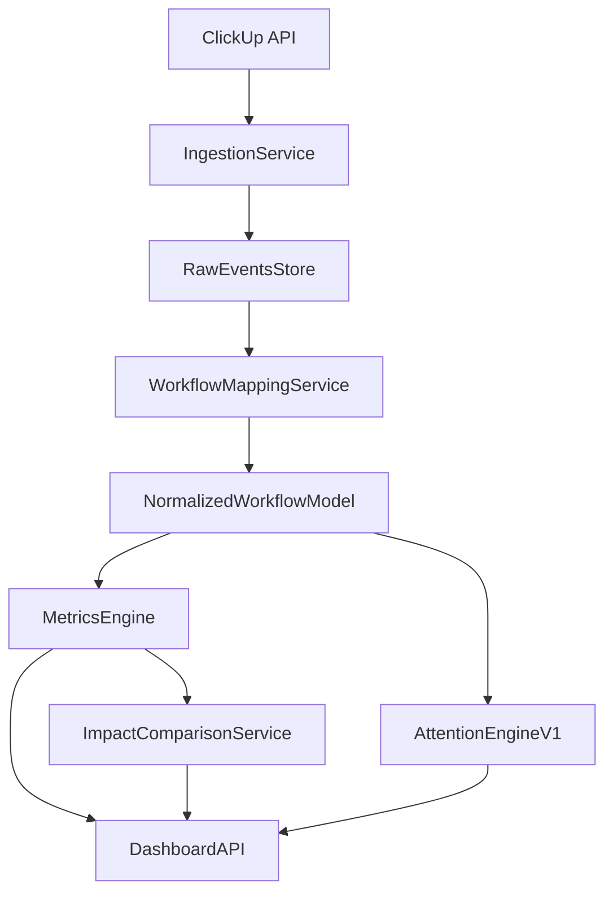

# MVP Implementation Plan

## 1) Objective

Build a standalone web product (MVP) that:

- connects to ClickUp;
- imports historical and ongoing task workflow data;
- calculates lifecycle metrics;
- highlights tasks requiring manager attention;
- shows before/after impact to prove product value.

This plan is execution-focused and follows the approved product scope.

## 2) MVP Functional Scope

Must-have capabilities:

1. Account and workspace setup.
2. Email verification for newly registered users.
3. Workspace member invitations and role-based membership.
4. ClickUp connection.
5. Historical data import (2-3 months).
6. Incremental sync job.
7. Workflow mapping setup.
8. Lifecycle metrics engine.
9. Attention Engine v1.
10. Dashboard UI.
11. Value/Impact (before vs after) dashboard.
12. Russian-first user interface across all MVP screens.

Out of scope:

- advanced ML predictions;
- multi-integrations in same release;
- enterprise white-label and on-prem packaging.

MVP+ scope (immediately after core MVP):

- AI Task Description Quality scoring.
- AI narrative summaries for flagged tasks and weekly bottlenecks.
- AI suggested manager actions (guardrailed templates).

## 3) Recommended Delivery Architecture (MVP)

Suggested stack (Python-first):

- Backend API: FastAPI
- Background jobs: Celery (or equivalent worker queue)
- Relational store: PostgreSQL
- Optional analytics acceleration: ClickHouse later if needed
- Frontend: React (or Next.js)

UX/application structure should mirror the proven Research Flow shell pattern:

- public/auth pages without sidebar;
- authenticated app pages with sidebar + top bar shell;
- workspace-centric navigation and settings area;
- separate admin/settings routes in the same app.

Localization requirement:

- All user-facing MVP screens and system messages must be in Russian.
- Build with i18n-ready structure so English can be added later with minimal refactor.

### 3.1 i18n Implementation Approach (MVP)

Use a key-based localization model from day one.

Defaults:

- Default locale: `ru`
- Fallback locale: `en`

Rules:

1. No hardcoded UI strings in components.
2. All user-facing text must be resolved through translation keys.
3. Error messages from backend should support localization keys or mapped translation codes.
4. Date/time/number formatting should use locale-aware formatters.

Suggested translation domains:

- `common.*` (buttons, labels, generic actions)
- `auth.*` (registration, login, email verification)
- `workspace.*` (members, invites, roles, settings)
- `integration.clickup.*` (connection, scope selection, sync states)
- `workflowMapping.*` (status mapping and validation messages)
- `dashboard.*` (metrics, charts, filters)
- `attention.*` (signals, severity labels, action prompts)
- `impact.*` (before/after value view and commentary)
- `aiInsights.*` (MVP+ narrative summaries and recommendations)

Quality gates:

- Block release if untranslated keys remain in `ru`.
- Add a test/check that reports missing keys for `ru` and `en`.
- Keep copy glossary for consistent terminology across metrics and statuses.

MVP data flow:

## 4) Execution Phases

### Phase 0 - Product and Metric Decisions

Deliverables:

- Freeze metric definitions for MVP.
- Freeze baseline/adoption measurement windows.
- Define status categories and mapping UX requirements.

Exit criteria:

- Signed-off metric glossary and workflow mapping rules.

### Phase 1 - Project Bootstrap

Deliverables:

- Backend and frontend repositories initialized.
- Environment and config strategy.
- Auth and basic workspace model (owner/admin/member roles).
- Registration email verification flow.
- Workspace invitation flow (invite, accept, revoke).
- Russian-first localization baseline (routing/text strategy and translation dictionary scaffolding).
- Initial CI checks (lint/test skeleton).

Exit criteria:

- User can register, verify email, sign in, create workspace shell, and invite teammate.

### Phase 2 - ClickUp Integration

Deliverables:

- OAuth/API token connection flow.
- "Select scope" UI (workspace/list/project).
- Connection validation endpoint.

Exit criteria:

- Connected workspace can fetch project/list metadata and statuses.

### Phase 3 - Data Ingestion Pipeline

Deliverables:

- Historical import job (2-3 months).
- Incremental sync job (scheduled).
- Ingest task core fields, status changes, assignees, timestamps, available time data.
- Data quality checks and retry logic.

Exit criteria:

- Stable ingestion with repeatable sync and observable logs.

### Phase 4 - Workflow Mapping Setup (Critical)

Deliverables:

- Fetch all source statuses from selected ClickUp scope.
- Auto-suggest mapping to normalized categories.
- Mapping confirmation/edit UI.
- Save mapping version per connected scope.

Normalized categories (MVP):

- Not Started
- Ready
- In Progress
- Review
- QA
- Blocked
- Done
- Cancelled

Behavior rules:

- No analytics until mapping is confirmed.
- Mapping changes create a new mapping version.
- Impact comparisons can be segmented by mapping version.

Exit criteria:

- Source statuses are fully mapped and persisted.

### Phase 5 - Normalized Data Model and Storage

Deliverables:

- Persistent model for tasks, transitions, mapping, and computed snapshots.
- Derived lifecycle events for metrics engine.
- Data retention strategy for pilot scale.

Exit criteria:

- Metrics engine can query normalized lifecycle records reliably.

### Phase 6 - Lifecycle Metrics Engine

Deliverables:

- Compute Lead Time, Cycle Time, Time in Status, Idle Time, Flow Efficiency.
- Compute Rework Rate, Loop Count, Reopen Rate.
- Aggregations by period and task type.

Exit criteria:

- Metrics are available via API and match validation samples.

### Phase 7 - Attention Engine v1

Deliverables:

- Rule-based scoring for task attention priority.
- Initial signals:
  - stuck in status (vs baseline quantiles),
  - high loop count,
  - inactivity threshold breach,
  - overdue/open too long.
- Task-level explanation payload for each flag.

Exit criteria:

- "Top tasks requiring attention" list available with reasons and severity.

### Phase 8 - Dashboard UI

Deliverables:

- Overview metrics cards.
- Bottleneck/time-in-status views.
- Attention list with filters and drilldown.
- Trend charts (weekly).
- App shell parity pattern:
  - auth/public routes without shell;
  - app routes with sidebar + top bar;
  - workspace settings/members/invites screens.

Exit criteria:

- Managers can identify priorities without raw report export.

### Phase 8.5 - AI Assist Layer (MVP+)

Deliverables:

- Task Description Quality analysis endpoint and UI badge.
- AI narrative summary for weekly bottlenecks and impact changes.
- AI next-step suggestions with evidence references from deterministic metrics.
- AI usage logging (viewed, accepted, ignored actions).

Constraints:

- Deterministic metrics remain source of truth.
- AI output must be grounded in observed task facts and metric deltas.
- Recommendation text must come from controlled templates.

Exit criteria:

- Managers receive useful AI summaries without reducing trust in core analytics.

### Phase 9 - Value / Impact Dashboard

Deliverables:

- Baseline snapshot at pilot start.
- Current period snapshot.
- Before/after comparison cards and charts.
- Change commentary block ("what improved / worsened").

Exit criteria:

- Product can generate a clear internal value report from real usage.

### Phase 10 - Internal Pilot and Iteration

Deliverables:

- 2-4 week active use by your team managers.
- Intervention log (actions taken based on product signals).
- Post-pilot review and prioritized backlog for next release.

Exit criteria:

- Decision: proceed to external pilot (Yandex Tracker or Jira partner).

## 5) Attention Engine v1 Rules (Initial Spec)

Use transparent, explainable rules in MVP.

Suggested score components:

- StatusDelayScore
- LoopScore
- InactivityScore
- OverdueScore

Example final score:

`AttentionScore = 0.4 * StatusDelay + 0.25 * Loop + 0.2 * Inactivity + 0.15 * Overdue`

Each flagged task must include:

- triggered rules;
- baseline comparison (for example "3.1x above median QA time");
- suggested manager next step.

## 6) Baseline vs After-Use Implementation Notes

To emphasize value, build this into MVP from day one:

1. On first successful historical import, persist baseline snapshot.
2. Recompute periodic snapshots weekly.
3. Compare baseline to current/adoption windows.
4. Keep definitions stable; if mapping changes, segment results by mapping version.

## 7) Delivery Timeline (Practical)

Suggested schedule (can be adjusted):

- Weeks 1-2: Phases 0-2
- Weeks 3-4: Phases 3-5
- Weeks 5-6: Phases 6-8
- Week 7: Phase 8.5 + Phase 9
- Weeks 8-10: Phase 10 (pilot and iteration)

## 8) Risks and Mitigation

Risk: inconsistent source workflows.

- Mitigation: mandatory mapping step + mapping versioning.

Risk: weak value evidence.

- Mitigation: baseline snapshot + impact dashboard in MVP.

Risk: noisy outliers skew metrics.

- Mitigation: medians/quantiles and task-type segmentation.

Risk: product perceived as employee control.

- Mitigation: process-level framing, system bottlenecks, non-punitive language.

Risk: AI outputs are generic or incorrect.

- Mitigation: AI only summarizes deterministic findings and mapped task facts.
- Mitigation: explicit citations in AI text ("based on loop count/time-in-status").
- Mitigation: allow easy user feedback on AI output quality.

## 9) "Robots" Plan for MVP Creation

If "robots" means autonomous workstreams/agents, split execution into parallel lanes:

1. Product Robot
   - finalizes metric glossary, attention rules, and acceptance criteria.
2. Integration Robot
   - implements ClickUp auth, scope selection, and ingestion connectors.
3. Data Robot
   - builds normalized schema, mapping persistence, snapshot generation.
4. Analytics Robot
   - implements lifecycle metrics and validation scripts.
5. Attention Robot
   - implements scoring, rule explanations, and API payloads.
6. Frontend Robot
   - builds onboarding, mapping UI, dashboard, and value screen.
7. Pilot Robot
   - runs pilot checklist, intervention log, and before/after reporting.
8. AI Assist Robot
   - implements grounded prompt layer, quality scoring flow, and AI insight panels.

This decomposition helps execute MVP faster while keeping ownership clear.

## 10) Definition of Done (MVP)

MVP is complete when:

1. A manager can connect ClickUp and map statuses.
2. Historical data loads and incremental sync runs.
3. Dashboard shows lifecycle metrics and flagged tasks.
4. Each flagged task includes explainable reason(s).
5. Value dashboard compares baseline vs current period.
6. Pilot team uses the product and can review measurable impact.

Optional MVP+ completion:

7. AI insights are available, grounded, and usage is measurable.
